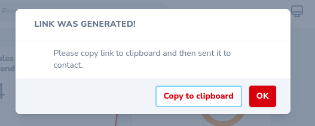

# Nova Response dynamic Modal

[](https://github.com/yaroslawww/nova-response-dynamic-modal/blob/master/LICENSE.md)
[](https://packagist.org/packages/yaroslawww/nova-response-dynamic-modal)
[](https://packagist.org/packages/yaroslawww/nova-response-dynamic-modal)

| Nova | Package |
|------|---------|
| V1   | V1      |
| V4   | V2      |

### Install

```bash
composer require yaroslawww/nova-response-dynamic-modal
```

### Usage

```php
<?php
return Action::modal('response-dynamic-modal', [
                'title' => 'Link was generated!',
                'message' => 'Please copy link to clipboard and then sent it to contact.',
                'copy' => $checkout->url,
            ]);
```


